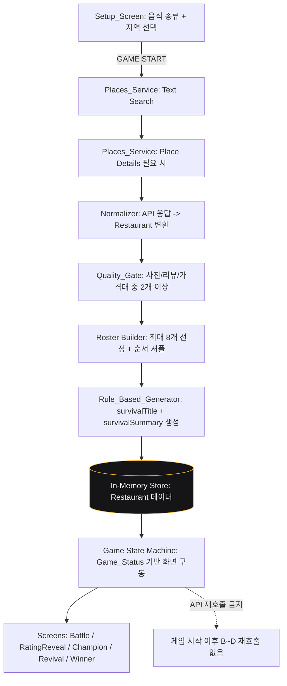
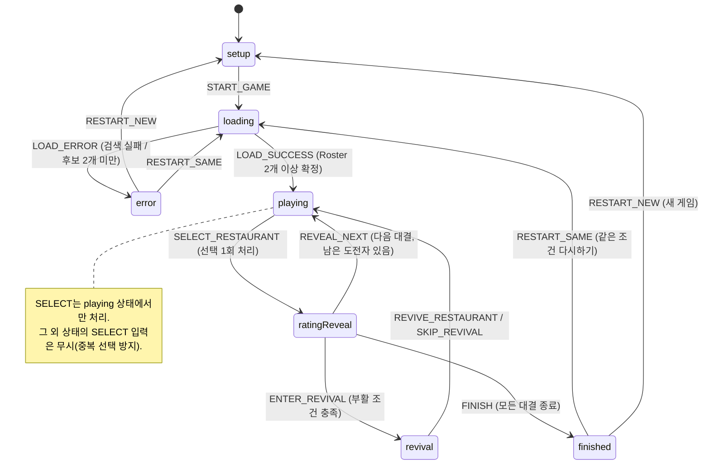

# 기술 설계 문서

## Overview

**LAST DISH STANDING**("Only One Restaurant Survives.")은 사용자가 지역과 음식 종류를 선택한 뒤, Google Places에서 확보한 실제 식당들을 1:1로 비교하며 자신의 취향에 맞는 최종 식당 한 곳을 선택하는 게임형 맛집 탐색 웹서비스이다. 선택 전에는 평점을 숨기고, 선택 후에만 두 식당의 실제 평점을 공개하여 "대중의 평가 vs 나의 취향"을 비교하게 한다. 선택된 식당은 CHAMPION으로 살아남아 새로운 CHALLENGER와 계속 경쟁하고, 마지막까지 살아남은 식당을 최종 WINNER로 결정한다.

본 설계는 하루 안에 구현하는 단기 프로젝트를 전제로 한다. 따라서 설계의 핵심 원칙은 다음과 같다.

1. **하나의 게임 상태 머신(Game State Machine)이 모든 UI를 구동한다.** `Game_Status` 값에 따라 어떤 화면(Screen)을 렌더링할지 결정하며, 화면은 상태를 직접 변경하지 않고 상태 머신에 이벤트(action)만 전달한다.
2. **게임 상태(Game State)와 UI 상태(UI State)를 명확히 분리한다.** 게임 진행 데이터는 단일 진실 공급원(single source of truth)인 리듀서/훅에서 관리하고, 순수한 표현용 상태(호버, 애니메이션 트리거 등)만 컴포넌트 로컬 상태로 둔다.
3. **핵심 게임 루프를 최우선으로 완성한다.** 지역·음식 선택 → 식당 후보 구성 → 1:1 대결 → 선택 후 평점 공개 → 승자 생존 및 다음 도전자 → 조건부 패자부활전 → 최종 Winner. 패자부활전과 애니메이션은 그 이후의 우선순위이다.
4. **게임 시작 이후 Google Places API를 재호출하지 않는다.** 게임 시작 시 확보한 `Restaurant` 데이터를 클라이언트 메모리에 저장하고 게임 내내 재사용한다.

기술 스택은 React + TypeScript + Vite + Google Places API + HTML/CSS이며, 스타일링 방식은 하나로 통일하고 전역 상태 관리 라이브러리(Redux 등)나 백엔드/데이터베이스는 사용하지 않는다.

## Architecture

### 계층 구조

본 서비스는 세 계층으로 구성된다.

- **Presentation Layer (표현 계층)**: React 화면(Screen)과 재사용 가능한 컴포넌트. `Game_Status`에 따라 어떤 화면을 렌더링할지 선택하고, 사용자 입력을 이벤트로 상태 머신에 전달한다.
- **Game Logic Layer (게임 로직 계층)**: 순수 함수로 구성된 리듀서(상태 머신)와 게임 규칙(품질 검증, Roster 구성, 라운드 계산, 평점 비교, 패자부활 트리거 판정). 부수 효과가 없어 테스트가 용이하다.
- **Data Layer (데이터 계층)**: Google Places 서비스(검색/상세), API 응답을 `Restaurant`로 변환하는 정규화기(normalizer), 규칙 기반 별명·한 줄 소개 생성기(Rule_Based_Generator), 그리고 게임 세션 동안 데이터를 보관하는 인메모리 저장소(React state).

### 데이터 흐름 다이어그램



게임 시작(`GAME START`) 시점에 한 번만 검색·상세·정규화·생성이 수행되고, 이후 모든 화면 전환(대결, 평점 공개, 패자부활전, Winner)은 인메모리 저장소의 데이터만 재사용한다. 동일 Place ID에 대한 반복 요청도 하지 않는다.

### 게임 상태 다이어그램



### 폴더 구조

```text
src/
  components/         재사용 가능한 UI 빌딩 블록
    RestaurantCard.tsx
    RoundIndicator.tsx
    VersusIndicator.tsx
    Spotlight.tsx
    PriceLevel.tsx
    ReviewBox.tsx
    PhotoWithFallback.tsx
    LoadingScreen.tsx
    ErrorScreen.tsx
  screens/            Game_Status에 대응하는 화면
    StartScreen.tsx
    BattleScreen.tsx
    RatingReveal.tsx
    ChampionReveal.tsx
    RevivalRound.tsx
    WinnerScreen.tsx
  game/               게임 로직 계층 (순수 함수)
    reducer.ts        상태 머신 리듀서
    actions.ts        action 타입 정의
    rules.ts          품질 검증, 라운드 계산, 패자부활 트리거, 평점 비교
    useGame.ts        useReducer 래핑 훅 (단일 진실 공급원)
  services/
    placesService.ts  Google Places 검색 + 상세 (Field Mask)
    normalizer.ts     API 응답 -> Restaurant 변환
  lib/
    generator.ts      규칙 기반 별명/한 줄 소개 생성
    shuffle.ts        무작위 순서 재배치
  types/
    index.ts          Restaurant, GameState, GameStatus 등 공용 타입
  styles/             통일된 스타일 (CSS Modules 또는 단일 방식)
  App.tsx             Game_Status에 따라 화면을 스위칭하는 루트
  main.tsx
```

## Components and Interfaces

### 게임 상태와 UI 상태의 분리

design-prompt 22절에 따라 게임 상태와 UI 상태를 명확히 분리한다.

- **게임 상태(단일 진실 공급원)**: `useGame` 훅이 `useReducer`로 `GameState`를 관리한다. 모든 화면 전환의 근거가 되는 `status`, Roster, 챔피언/도전자, 라운드, 연승, 탈락 목록, 패자부활 관련 플래그 등을 포함한다.
- **UI 상태(로컬)**: 각 컴포넌트가 로컬 `useState`로 관리하는 순수 표현 상태(예: 애니메이션 진행 여부, 스포트라이트 트랜지션 트리거, 호버 효과). 게임 결과에 영향을 주지 않는다.

`App` 컴포넌트는 `useGame()`으로부터 `state`와 `dispatch`를 받아, `state.status` 값에 따라 렌더링할 화면을 선택하고 화면에 `state`(읽기 전용)와 필요한 콜백(내부적으로 `dispatch` 호출)을 props로 내려준다. 화면은 게임 상태를 직접 변경하지 않고 이벤트만 올려보낸다.

### 컴포넌트 트리와 책임

| 컴포넌트 | 대응 Game_Status | 책임 | 주요 props |
| --- | --- | --- | --- |
| `App` | 전체 | `status`에 따라 화면 스위칭, `useGame` 소유 | 없음(루트) |
| `StartScreen` | `setup` | 음식 종류/지역 선택, 시작 버튼 활성/비활성 | `onStart(setup)`, `disabled` |
| `LoadingScreen` | `loading` | 로딩 표시, 시작 버튼 재입력 차단 | 없음 |
| `BattleScreen` | `playing` | 두 식당 1:1 비교, 선택 UI 제공(평점 미표시) | `champion`, `challenger`, `round`, `totalRounds`, `onSelect(id)` |
| `RatingReveal` | `ratingReveal` | 두 식당 평점·리뷰 수 공개, 비교 메시지, 다음 CTA | `battleResult`, `comparison`, `onNext` |
| `ChampionReveal` | `ratingReveal`(연출 단계) | NEW CHAMPION / WIN STREAK 연출 | `champion`, `winStreak` |
| `RevivalRound` | `revival` | 탈락 후보(최대 3개) 표시, 부활 선택/건너뛰기 | `candidates`, `onRevive(id)`, `onSkip` |
| `WinnerScreen` | `finished` | 최종 Winner 전체 정보 + Google Maps 링크 | `winner`, `winStreak`, `winCount`, `totalRounds`, `onRestartSame`, `onRestartNew` |
| `ErrorScreen` | `error` | 후보 부족/오류 안내, 다른 조건 선택 유도 | `message`, `onRetry` |

공용 빌딩 블록:

| 컴포넌트 | 책임 | 주요 props |
| --- | --- | --- |
| `RestaurantCard` | 서바이벌 참가자 카드(별명, 사진, 식당명, 카테고리·지역, 가격대, 한 줄 소개, 대표 리뷰). `showRating`이 true일 때만 평점 영역 렌더링 | `restaurant`, `showRating`, `spotlight` |
| `RoundIndicator` | 현재 라운드 / 전체 라운드 표시(동적 값) | `current`, `total` |
| `VersusIndicator` | 중앙 VS 표시(RED) | 없음 |
| `Spotlight` | 승자 조명 ON(Gold Glow/Border) / 패자 조명 OFF(어둡게/채도 감소) | `state: 'on' \| 'off' \| 'neutral'` |
| `PriceLevel` | 가격대 표시, 없으면 "가격 정보 없음" | `priceLevel?` |
| `ReviewBox` | 대표 리뷰 표시, 없으면 "표시할 수 있는 리뷰가 없습니다" | `review?` |
| `PhotoWithFallback` | 사진 표시, 없으면 placeholder 이미지 | `photoUrl?`, `alt` |

### 상태 머신 정의

#### GameState 형태

```ts
interface GameState {
  status: GameStatus;              // setup | loading | playing | ratingReveal | revival | finished | error
  setup: SetupInput;               // { foodType, region }
  rosterOrder: string[];           // 확정된 참가 식당 id를 등장 순서대로 (셔플된 상태)
  restaurantsById: Record<string, Restaurant>; // 인메모리 저장소
  currentChampion: string | null;  // 현재 챔피언 id
  currentChallenger: string | null;// 현재 도전자 id
  nextIndex: number;               // rosterOrder에서 다음 도전자를 가리키는 인덱스
  currentRound: number;            // 현재 일반 대결 번호 (1부터)
  totalRounds: number;             // 참가 식당 수 - 1
  winStreak: number;               // 현재 챔피언 연승
  winCount: number;                // 현재 챔피언 누적 승리 횟수
  eliminated: string[];            // 탈락 식당 id 누적
  revivalEligible: boolean;        // 게임 시작 시 Roster >= 6 이면 true
  revivalUsed: boolean;            // 게임 세션당 1회 제한
  revivalCandidates: string[];     // 패자부활 후보(최대 3개)
  lastBattle: BattleResult | null; // 직전 대결 결과(승자/패자 id)
  selectedId: string | null;       // 직전 선택된 식당 id
  error: string | null;
}
```

#### 액션 / 이벤트

| Action | 발생 시점 | 리듀서 전이 요약 |
| --- | --- | --- |
| `START_GAME` | Setup에서 시작 버튼 클릭 | `setup` → `loading`, setup 저장 |
| `LOAD_SUCCESS` | 검색·정규화·품질검증·Roster·생성 완료(2개 이상) | `loading` → `playing`, Roster/저장소/챔피언·첫 도전자 세팅, `totalRounds = 참가 수 - 1`, `revivalEligible = 참가 수 >= 6`, `currentRound = 1` |
| `LOAD_ERROR` | 검색 실패 또는 품질 통과 식당 2개 미만 | `loading` → `error`, 안내 메시지 저장(확보 데이터 유지) |
| `SELECT_RESTAURANT` | `playing`에서 식당 선택 | **`status !== 'playing'`이면 무시(중복/이중 클릭 방지).** 선택 식당=승자, 상대=탈락 처리, `lastBattle`/`selectedId` 기록, 챔피언 변경 시 `winStreak=1`·유지 시 `winStreak++`, `status` → `ratingReveal` |
| `REVEAL_NEXT` | `ratingReveal`에서 다음 CTA | 남은 도전자 있으면 다음 도전자 세팅 후 `playing`(`currentRound++`), 패자부활 트리거 충족 시 `revival`, 모두 끝났으면 `finished` |
| `ENTER_REVIVAL` | 패자부활 조건 충족 시 `REVEAL_NEXT` 내부 분기 | `ratingReveal` → `revival`, 탈락 식당에서 후보 산출(최대 3개, 챔피언 제외) |
| `REVIVE_RESTAURANT` | 부활 후보 선택 | 선택 식당을 다음 도전자로, `revivalUsed=true`, `revival` → `playing`(`currentRound++`) |
| `SKIP_REVIVAL` | 건너뛰기 | `revivalUsed=true`, `revival` → `playing`(다음 일반 도전자, `currentRound++`) |
| `FINISH` | 모든 대결 종료 | `ratingReveal` → `finished`, 현재 챔피언을 Winner로 확정 |
| `RESTART_SAME` | Winner/에러에서 같은 조건 다시하기 | 지역·음식 유지, 후보 순서 재셔플, 상태 초기화 후 `loading`(또는 저장 데이터 재사용 시 `playing` 재구성) |
| `RESTART_NEW` | 새 게임 | 지역·음식 초기화, 전체 상태 초기화 → `setup` |

**패자부활 트리거 평가(`REVEAL_NEXT` 내부)**: `revivalEligible && !revivalUsed && eliminated.length >= 3`일 때 트리거 후보로 판단한다. 시점 규칙은 다음과 같다.

- Roster 8개: 4번째 일반 대결 종료(누적 탈락 4개) 시점에 실행.
- Roster 6~7개: 누적 탈락 3개에 도달한 직후 대결 종료 시점에 실행.
- 조건 미충족 시 일반 대결을 계속 진행한다. 이미 1회 실행했다면 다시 실행하지 않는다.

**연승 규칙**: 대결 승자가 기존 챔피언과 동일하면 `winStreak++`, `winCount++`. 도전자가 이기면 새 챔피언 지정, `winStreak = 1`, `winCount = 1`.

### Google Places 서비스 인터페이스

```ts
interface PlacesSearchParams {
  region: string;      // 지역(직접 입력 또는 프리셋)
  foodType: string;    // 음식 종류
}

interface PlacesService {
  // Text Search: 지역 + 음식 종류로 후보 목록 확보
  searchRestaurants(params: PlacesSearchParams): Promise<RawPlace[]>;
  // Place Details: 리뷰/사진 등 부족한 필드를 필요한 경우에만 보강
  getDetails(placeId: string): Promise<RawPlaceDetails>;
}
```

- **두 단계 요청**: Text Search로 후보 목록을 얻고, 화면·게임 로직에 필요한 필드가 부족한 경우에만 Place Details를 호출한다. 매 라운드마다 호출하지 않는다.
- **Field Mask**: Field Mask를 지원하는 요청에서는 화면과 게임 로직에서 사용하는 필드(식당명, 카테고리, 주소, 사진, 가격대, 평점, 리뷰 수, 리뷰, Google Maps 링크)만 지정한다.
- **정규화기(normalizer)**: `RawPlace`/`RawPlaceDetails`를 `Restaurant`로 변환한다. 사진·리뷰·가격대·평점 등은 누락될 수 있으므로 optional로 매핑하고, API가 제공하지 않는 정보는 생성하지 않는다. 제공받은 리뷰만 사용한다.

```ts
function normalizePlace(raw: RawPlace, details?: RawPlaceDetails): Omit<Restaurant, 'survivalTitle' | 'survivalSummary'>;
```

### Quality Gate / Roster Builder / 라운드 계산

```ts
// 핵심 비교 정보 3가지 중 2개 이상 확보 시 후보
function passesQualityGate(r: { photoUrl?: string; reviews: RestaurantReview[]; priceLevel?: number }): boolean {
  const hasPhoto = !!r.photoUrl;
  const hasReview = r.reviews.length > 0;
  const hasPrice = r.priceLevel !== undefined;
  return [hasPhoto, hasReview, hasPrice].filter(Boolean).length >= 2;
}

// 후보 중 최대 8개 선정 후 등장 순서 무작위 셔플, Place ID 유일성 보장
function buildRoster(candidates: Restaurant[]): Restaurant[]; // length in [0..8]

// 일반 대결 수 = 참가 식당 수 - 1 (하드코딩 금지)
function calcTotalRounds(participantCount: number): number { return participantCount - 1; }
```

`buildRoster`는 후보가 8개 이상이면 8개를 선정하고, 2~7개면 전부 사용하며, 조건 미달 식당을 채워 넣지 않는다. 동일 Place ID 중복을 제거하여 Roster 내 각 Place ID가 유일하도록 한다. 2개 미만이면 게임을 시작하지 않고 `LOAD_ERROR`로 전이한다.

### 규칙 기반 별명·한 줄 소개 생성기

```ts
interface GeneratorInput {
  category?: string;
  region: string;
  priceLevel?: number;
  reviews: RestaurantReview[];
}

interface GeneratedText {
  survivalTitle: string;   // 6~18자
  survivalSummary: string; // 한 문장
}

function generateSurvivalText(input: GeneratorInput): GeneratedText;
```

- **키워드 탐색**: 리뷰 텍스트에서 미리 정의된 키워드(분위기, 데이트, 가성비, 친절, 웨이팅, 와인, 파스타, 디저트, 뷰, 조용 등)를 탐색한다.
- **템플릿 선택**: 카테고리·지역·가격대·탐색된 키워드를 조합하여 사전 정의 템플릿에서 별명과 한 줄 소개를 생성한다. 별명은 6~18자 범위로 맞춘다.
- **사실 왜곡 금지**: 존재하지 않는 메뉴/서비스/시설/셰프/수상 기록을 생성하지 않고, "서울 최고", "미슐랭급" 같은 사실 확인 어려운 최상급 표현을 사용하지 않는다.
- **fallback**: 특징 판단 정보가 부족하면 별명은 "오늘의 도전자", 한 줄 소개는 "현재 검색 조건에 맞는 식당 후보입니다."를 사용한다.
- 별명·한 줄 소개가 게임용 표현임을 알리는 안내를 서비스 내 적절한 위치에 1회 이상 표시한다.

## Data Models

### Restaurant / RestaurantReview

```ts
interface RestaurantReview {
  text: string;
  rating?: number;
  authorName?: string;
}

interface Restaurant {
  id: string;                 // Google Place ID
  name: string;
  address?: string;
  category?: string;
  photoUrl?: string;
  priceLevel?: number;
  rating?: number;
  userRatingCount?: number;
  reviews: RestaurantReview[];
  survivalTitle: string;      // 게임용 별명 (6~18자, 또는 fallback)
  survivalSummary: string;    // 게임용 한 줄 소개 (또는 fallback)
  googleMapsUrl?: string;
}
```

### GameStatus / SetupInput / BattleResult / RatingComparison

```ts
type GameStatus =
  | 'setup'
  | 'loading'
  | 'playing'
  | 'ratingReveal'
  | 'revival'
  | 'finished'
  | 'error';

interface SetupInput {
  foodType: string; // 한식 | 일식 | 중식 | 이탈리안 | 프렌치 | 양식 | 카페 | 디저트
  region: string;   // 직접 입력 또는 프리셋(성수/강남/홍대/잠실/이태원)
}

interface BattleResult {
  winnerId: string;
  loserId: string;
  round: number;
}

type RatingComparison =
  | { kind: 'higher' }        // 선택 식당 평점이 더 높음 (대중 평가와 일치)
  | { kind: 'lower' }         // 선택 식당 평점이 더 낮음 (평점보다 내 취향)
  | { kind: 'equal' }         // 평점 동일
  | { kind: 'insufficient' }; // 한쪽 이상 평점 없음
```

### 평점 비교 함수

승패에 영향을 주지 않으며, 네 가지 메시지 변형 중 하나를 결정하기 위한 순수 함수이다.

```ts
function compareRatings(
  chosen: Restaurant,
  other: Restaurant
): RatingComparison {
  if (chosen.rating === undefined || other.rating === undefined) {
    return { kind: 'insufficient' };
  }
  if (chosen.rating > other.rating) return { kind: 'higher' };
  if (chosen.rating < other.rating) return { kind: 'lower' };
  return { kind: 'equal' };
}
```

- `higher` → 대중적 평가와 사용자의 선택이 일치했음을 나타내는 메시지
- `lower` → 평점보다 사용자의 취향이 선택 식당이었음을 나타내는 메시지
- `equal` → 평점은 같지만 사용자의 선택은 해당 식당이었음을 나타내는 메시지
- `insufficient` → 평점 비교 정보가 부족함을 나타내는 메시지(선택 기준으로 결과 유지)

## UI/UX Design

### 화면 상태 ↔ 컴포넌트 ↔ Game_Status 매핑

design-prompt에서 정의한 9개 화면 상태를 컴포넌트와 게임 상태에 매핑한다. 일부 화면 상태는 동일 `Game_Status` 내의 연출 단계로 구현된다.

| 화면 상태 | 대응 컴포넌트 | Game_Status | 비고 |
| --- | --- | --- | --- |
| START | `StartScreen` | `setup` | Lobby 분위기 |
| BATTLE | `BattleScreen` | `playing` | 평점 미표시 |
| RATING REVEAL | `RatingReveal` | `ratingReveal` | 두 식당 평점 공개 + 비교 메시지 |
| NEW CHAMPION | `ChampionReveal` | `ratingReveal` | RatingReveal 이후 짧은 챔피언 연출 단계 |
| NEXT CHALLENGER | `BattleScreen`(등장 애니메이션) | `playing` | 챔피언 유지 + 새 도전자 slide-in/fade |
| ELIMINATION | `Spotlight`(off) + `RestaurantCard` | `ratingReveal` | 패자 카드 어둡게 + "탈락/ELIMINATED" |
| REVIVAL ROUND | `RevivalRound` | `revival` | RED accent, 최대 3개 후보 |
| REVIVED CHALLENGER | `BattleScreen`(REVIVED 배지) | `playing` | 부활 식당이 다음 도전자 |
| FINAL WINNER | `WinnerScreen` | `finished` | Gold 최대 활용 |

### 컬러 시스템

| 역할 | 색상 |
| --- | --- |
| 전체 배경 (Stage) | `#0A0A0B` |
| 카드 / Surface | `#151518` |
| 보조 Surface | `#202024` |
| 기본 Border | `#34343A` |
| Primary Text | `#F5F5F5` |
| Secondary Text | `#A7A7AD` |
| Winner / Champion | `#F5B82E` |
| Winner Highlight | `#FFD866` |
| Battle / VS | `#E53935` |
| Elimination / Revival | `#FF3B30` |
| Eliminated | `#5A5A61` |

**의미 일관성**: GOLD → Winner/Champion/Spotlight/Win Streak/Final Winner, RED → VS/Battle/Elimination/Revival Round, GRAY → Eliminated/Disabled/Spotlight OFF, BLACK → Stage/Background. 평상시에는 Gold를 절제하고, 선택·챔피언 결정·최종 Winner 순간에 강하게 등장시킨다. 파스텔·밝은 전체 배경·배달 앱·일반 맛집 검색 스타일·과도한 Glassmorphism은 사용하지 않는다.

### Spotlight 시스템

- **WINNER**: 위에서 Gold Spotlight, 카드 주변 Gold Glow, Gold Border 활성화, Brightness 증가.
- **LOSER**: Spotlight OFF, 카드 어둡게, saturation/opacity 감소(grayscale 계열).
- 규칙: **Winner = 빛이 들어옴 / Loser = 빛이 사라짐**. 단순 Badge가 아니라 무대 조명 은유로 표현한다.

### 애니메이션

- 상태 변화 연출에 **200ms ~ 600ms** 범위의 가벼운 CSS transition/animation만 사용한다.
- WebGL·3D 효과는 사용하지 않는다. 필요한 연출: 카드 등장, challenger slide-in, winner spotlight on, loser spotlight off, rating reveal, elimination fade, new champion, revival entrance, winner reveal.
- 사용자가 빠르게 다음 대결로 진행할 수 있도록 과도하게 긴 애니메이션은 피한다.

### 반응형

- **PC**: 두 식당을 좌우로 배치(`Restaurant A | VS | Restaurant B`).
- **모바일**: 세로 배치 허용(A / VS / B). 최소 화면 폭 **360px**까지 정상 동작.

### 선택 전 평점 미렌더링 (중요)

선택 전(`playing` 상태)에는 평점·리뷰 평균·평점 비교 결과를 **표시하지 않을 뿐 아니라 평점 컴포넌트 자체를 렌더링하지 않는다.** CSS로 숨기는 방식이 아니라 `RestaurantCard`의 `showRating` prop이 `false`일 때 평점 영역을 조건부로 렌더링하지 않는 방식을 사용한다. `ratingReveal` 상태에서만 `showRating`이 `true`가 된다.

### 스타일링 방식

스타일링은 하나의 방식으로 통일한다. 본 설계는 **CSS Modules**를 채택한다. 이유: 별도 런타임 라이브러리 없이 Vite가 기본 지원하고, 클래스 이름 충돌을 방지하며, 컴포넌트 단위로 스타일을 함께 관리할 수 있어 하루 프로젝트의 컴포넌트 재사용 구조와 잘 맞는다. 컬러 토큰은 `:root` CSS 변수로 정의하여 의미 일관성을 강제한다. 모서리는 작거나 중간 정도의 radius만 사용하고, 특정 방송 프로그램의 로고·그래픽·고유 UI는 복제하지 않는다.

## Correctness Properties

*프로퍼티(property)는 시스템의 모든 유효한 실행에 걸쳐 참이어야 하는 특성 또는 동작으로, 시스템이 무엇을 해야 하는지에 대한 형식적 진술이다. 프로퍼티는 사람이 읽는 명세와 기계가 검증 가능한 정확성 보장 사이의 다리 역할을 한다.*

본 서비스의 게임 로직 계층은 순수 함수(리듀서, 품질 검증, Roster 구성, 라운드 계산, 평점 비교, 패자부활 트리거, 별명 생성)로 구성되어 있어 property-based testing에 적합하다. 아래 프로퍼티는 모두 "모든 입력 X에 대해 P(X)가 성립한다"는 보편 정량화 형태로 기술한다.

### Property 1: 품질 검증은 핵심 정보 2개 이상과 동치

*모든* 식당에 대해, `passesQualityGate`가 참을 반환하는 것은 대표 사진·리뷰·가격대 중 확보된 개수가 2개 이상인 경우와 정확히 동치이다.

**Validates: Requirements 3.2, 3.3**

### Property 2: Roster 크기는 항상 [2, 8] 범위이며 후보 수에 종속

*모든* 후보 배열에 대해, 후보 수가 8개 이상이면 확정 Roster 크기는 정확히 8이고, 2~7개이면 후보 수와 같으며, 조건 미달 식당이 추가되지 않는다.

**Validates: Requirements 4.1, 4.2**

### Property 3: Roster 내 Place ID 유일성

*모든* (중복을 포함할 수 있는) 후보 배열에 대해, 확정 Roster 내 각 Place ID는 유일하다(id 집합의 크기 == Roster 길이).

**Validates: Requirements 4.4**

### Property 4: 순서 재배치는 참가 식당 집합을 보존

*모든* Roster에 대해, 등장 순서를 무작위로 재배치해도 재배치 전후의 식당 집합(멀티셋)과 길이는 동일하다.

**Validates: Requirements 4.5**

### Property 5: 별명 길이는 6~18자 범위

*모든* 별명 생성 입력에 대해, 생성된 `survivalTitle`의 길이는 6자 이상 18자 이하이다(정보가 부족한 경우의 fallback 포함).

**Validates: Requirements 5.3, 5.5**

### Property 6: 일반 대결 수는 참가 식당 수 - 1

*모든* 2~8 범위의 참가 식당 수 n에 대해, 계산된 전체 일반 대결 수는 n - 1이다.

**Validates: Requirements 7.1, 7.4**

### Property 7: 모든 참가 식당이 최소 한 번 등장하고 최종 Winner는 1개

*모든* 유효한 Roster(크기 2~8)와 임의의 선택 시퀀스에 대해, 게임을 끝까지 진행하면 Roster의 모든 식당이 챔피언 또는 도전자로 최소 한 번 대결에 등장하며, 종료 시 최종 챔피언(Winner)은 정확히 1개이다.

**Validates: Requirements 7.4, 11.5, 14.1**

### Property 8: 선택된 식당은 평점과 무관하게 항상 승자

*모든* 두 식당 쌍과 사용자의 임의 선택에 대해, 평점 값과 무관하게 사용자가 선택한 식당이 해당 대결의 승자가 되고 상대는 탈락한다.

**Validates: Requirements 9.1, 9.2, 9.3, 10.6**

### Property 9: 선택 처리 후 추가 선택 입력은 무시(중복 선택 방지)

*모든* 대결에서 선택이 한 번 처리된 이후, `playing`이 아닌 상태에서 발생하는 추가 선택 입력은 무시되어 최초로 처리된 선택 결과를 변경하지 않는다.

**Validates: Requirements 9.4, 9.5**

### Property 10: 선택은 즉시 ratingReveal로, 다음 대결은 playing으로 전이

*모든* `playing` 상태의 선택에 대해, 상태는 다음 대결로 바로 넘어가지 않고 먼저 `ratingReveal`로 전이하며, 남은 도전자가 있는 경우 다음 진행에서 다시 `playing`으로 전이한다.

**Validates: Requirements 9.6, 17.2**

### Property 11: 평점 비교는 실제 대소·누락 관계를 정확히 분류

*모든* 두 식당의 평점 조합에 대해, `compareRatings`는 두 평점이 모두 존재할 때 선택 식당이 더 높으면 higher, 낮으면 lower, 같으면 equal을 반환하고, 하나 이상 누락되면 insufficient를 반환한다.

**Validates: Requirements 10.2, 10.3, 10.4, 10.5**

### Property 12: 연승은 챔피언 유지 시 증가, 교체 시 1로 리셋

*모든* 대결 시퀀스에 대해, 각 선택 처리 후 `winStreak`는 승자가 직전 챔피언과 동일하면 직전 값 + 1이고, 도전자가 승리하여 챔피언이 교체되면 1이다.

**Validates: Requirements 11.3, 11.4**

### Property 13: 패자부활은 시작 Roster가 6 이상일 때만 게임당 최대 1회

*모든* Roster에 대해 게임을 끝까지 진행하면, 패자부활전 실행 횟수는 시작 Roster 크기가 6 이상이면 최대 1회이고, 2~5이면 0회이다.

**Validates: Requirements 12.1, 12.2, 12.6, 13.9**

### Property 14: 패자부활은 누적 탈락 3개 이상에서만 실행되고 챔피언을 후보에서 제외

*모든* 패자부활전 진입 시점에 대해, 그 시점의 누적 탈락 식당 수는 3개 이상이며 부활 후보 목록에는 현재 챔피언이 포함되지 않는다.

**Validates: Requirements 12.3, 13.1**

### Property 15: 패자부활 후보 수는 min(탈락 수, 3)

*모든* 패자부활전 진입 상태에 대해, 후보 수는 탈락 식당이 3개를 초과하면 3개, 1~3개이면 탈락 식당 전부이다.

**Validates: Requirements 13.2, 13.3**

## Error Handling

| 상황 | 처리 |
| --- | --- |
| 품질 통과 식당 2개 미만 | `Game_Status`를 `playing`으로 전환하지 않고 `error`로 전이. 확보된 식당 데이터를 유지한 채 "대결 진행 식당이 부족하다"는 메시지와 다른 지역·음식 종류 선택 안내를 표시(`LOAD_ERROR`). |
| 로딩 중 | `loading` 상태를 표시하고 게임 시작 버튼을 비활성화하여 재입력을 차단한다. |
| 사진 누락 | `PhotoWithFallback`이 기본 placeholder 이미지를 표시한다. |
| 리뷰 누락 | `ReviewBox`가 "표시할 수 있는 리뷰가 없습니다" 안내를 표시한다. |
| 가격대 누락 | `PriceLevel`이 "가격 정보 없음"을 표시한다. |
| 평점 누락 | 평점 공개 단계에서 "평점 정보 없음"을 표시하고, 평점 비교는 `insufficient` 메시지로 처리한다. |
| API/네트워크 실패 | `loading` → `error`로 전이하고 오류 메시지 및 다시 시도/다른 조건 선택 안내를 표시한다. |
| 일부 데이터 누락(품질 통과) | 품질 조건을 통과했다면 누락 필드는 각 fallback으로 처리하고 게임을 정상 진행한다. |

핵심 원칙: 데이터 일부가 누락되어도 품질 게이트를 통과한 식당은 게임을 정상 진행하며, 누락된 각 필드는 위의 fallback UI로 대응한다.

## Testing Strategy

### 이중 테스트 접근

- **Property-based test (프로퍼티 테스트)**: 게임 로직 계층의 순수 함수와 리듀서에 대해 위 Correctness Properties를 검증한다. TypeScript용 PBT 라이브러리로 **fast-check**를 **Vitest**와 함께 사용한다(직접 구현하지 않고 라이브러리를 사용한다).
- **Unit test (단위 테스트)**: Places 정규화기(normalizer)의 구체적 매핑, 별명 fallback 등 특정 예시·엣지 케이스를 검증한다.
- **Component/interaction test**: `playing` 상태에서 평점 컴포넌트가 렌더링되지 않는지, 중복(이중) 클릭이 무시되는지, `loading` 상태에서 시작 버튼이 비활성화되는지를 검증한다(React Testing Library).

### 프로퍼티 테스트 구성 규칙

- 각 프로퍼티 테스트는 **최소 100회 반복**(fast-check 기본 runs를 100 이상으로 설정)한다.
- 각 프로퍼티 테스트는 대응하는 설계 문서의 프로퍼티를 주석으로 참조한다.
- 태그 형식: `// Feature: last-dish-standing, Property {번호}: {프로퍼티 내용}`
- 각 Correctness Property는 하나의 프로퍼티 테스트로 구현한다.

### 대상별 테스트 매핑

| 대상 | 테스트 방식 | 관련 프로퍼티 |
| --- | --- | --- |
| `passesQualityGate` | PBT | Property 1 |
| `buildRoster` | PBT | Property 2, 3 |
| `shuffle` | PBT | Property 4 |
| `generateSurvivalText` | PBT + 단위(빈 정보 fallback) | Property 5 |
| `calcTotalRounds` | PBT | Property 6 |
| 리듀서(전체 시뮬레이션) | PBT | Property 7, 8, 9, 10, 12, 13, 14, 15 |
| `compareRatings` | PBT | Property 11 |
| `normalizePlace` | 단위 테스트 | (정규화 매핑 검증) |
| API 재호출 금지 / 검색 와이어링 | mock 기반 통합 테스트 | Requirements 6.2, 6.3, 2.1 |
| 평점 미렌더링 / 이중 클릭 / 로딩 버튼 | 컴포넌트 테스트 | Requirements 8.2, 8.3, 9.5, 16.1 |
| API Key 환경 변수 | 정적/스모크 확인 | Requirements 18.1 |

### 우선순위

핵심 게임 루프 로직(리듀서 전이, 품질 게이트, Roster 구성, 라운드 계산, 평점 비교)을 먼저 테스트한다. 패자부활 관련 프로퍼티(13, 14, 15)와 애니메이션·시각 요소 검증은 그 이후에 다룬다. 이는 하루 프로젝트에서 "처음부터 Winner까지 정상 플레이 가능한 하나의 완성된 흐름"을 우선한다는 원칙과 일치한다.
