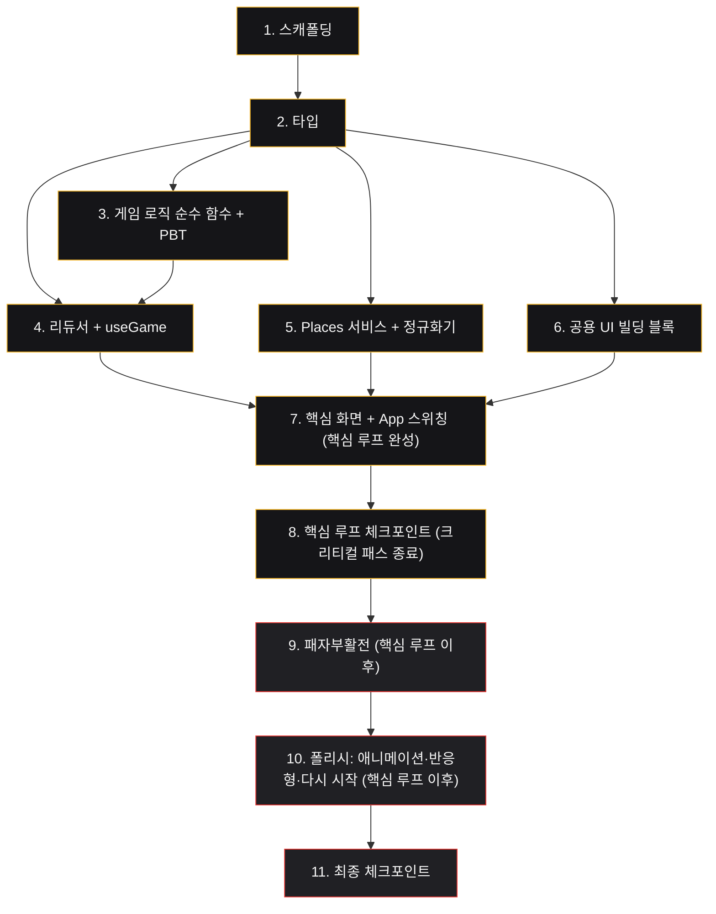

# Implementation Plan

LAST DISH STANDING

## Overview

이 계획은 하루 프로젝트 제약에 맞춰 **핵심 게임 루프**(지역·음식 선택 → 식당 후보 구성 → 1:1 대결 → 선택 후 평점 공개 → 승자 생존·다음 도전자 → 최종 Winner)를 먼저 끝까지 완성하고, 그 이후에 **패자부활전**과 **애니메이션·반응형·스포트라이트 폴리시**를 구현하도록 순서를 배치한다. 게임 로직 계층의 순수 함수는 대응하는 Correctness Property를 property-based test(fast-check + Vitest)로 함께 검증한다.

## Tasks

- [x] 1. 프로젝트 스캐폴딩 및 개발 환경 구성
  - Vite + React + TypeScript 프로젝트를 초기화하고 설계의 폴더 구조(`src/components`, `src/screens`, `src/game`, `src/services`, `src/lib`, `src/types`, `src/styles`)를 생성한다
  - CSS Modules 스타일링 방식을 채택하고, `src/styles`에 `:root` CSS 변수로 컬러 토큰(Stage `#0A0A0B`, Card `#151518`, Gold `#F5B82E`, Red `#E53935`, Gray `#5A5A61` 등)을 정의한다
  - API Key를 `VITE_GOOGLE_MAPS_API_KEY` 환경 변수로 관리하도록 설정하고, `.env`는 `.gitignore`에 추가하며 `.env.example`만 저장소에 포함한다
  - fast-check와 Vitest를 개발 의존성으로 추가하고 테스트 스크립트(`vitest --run`)를 구성한다
  - _Requirements: 17.4, 18.1, 18.2, 19.1, 19.2_

- [x] 2. 공용 타입 정의
  - `src/types/index.ts`에 `RestaurantReview`, `Restaurant`, `GameStatus`, `SetupInput`, `BattleResult`, `RatingComparison`, `GameState` 타입을 설계 사양대로 정의한다
  - `GameStatus`는 `setup | loading | playing | ratingReveal | revival | finished | error`로 정의한다
  - _Requirements: 17.1_

- [x] 3. 게임 로직 순수 함수 구현 및 프로퍼티 테스트
  - [x] 3.1 품질 검증 함수 `passesQualityGate` 구현
    - `src/game/rules.ts`에 사진·리뷰·가격대 중 2개 이상 확보 시 true를 반환하는 함수를 구현한다
    - _Requirements: 3.1, 3.2, 3.3, 3.4_

  - [x] 3.2 `passesQualityGate` 프로퍼티 테스트
    - **Property 1: 품질 검증은 핵심 정보 2개 이상과 동치**
    - **Validates: Requirements 3.2, 3.3** (fast-check 100회 이상, 태그 `// Feature: last-dish-standing, Property 1`)

  - [x] 3.3 Roster 구성 함수 `buildRoster` 구현
    - `src/game/rules.ts`에 후보 8개 이상이면 8개 선정, 2~7개면 전부, 조건 미달 추가 금지, Place ID 중복 제거를 구현한다
    - _Requirements: 4.1, 4.2, 4.4_

  - [x] 3.4 `buildRoster` 프로퍼티 테스트
    - **Property 2: Roster 크기는 항상 [2,8] 범위이며 후보 수에 종속**, **Property 3: Roster 내 Place ID 유일성**
    - **Validates: Requirements 4.1, 4.2, 4.4** (fast-check 100회 이상, 태그 `Property 2`, `Property 3`)

  - [x] 3.5 무작위 순서 재배치 함수 `shuffle` 구현
    - `src/lib/shuffle.ts`에 참가 식당 집합을 보존하며 순서만 재배치하는 함수를 구현한다
    - _Requirements: 4.5_

  - [x] 3.6 `shuffle` 프로퍼티 테스트
    - **Property 4: 순서 재배치는 참가 식당 집합을 보존**
    - **Validates: Requirements 4.5** (fast-check 100회 이상, 태그 `Property 4`)

  - [x] 3.7 라운드 계산 함수 `calcTotalRounds` 구현
    - `src/game/rules.ts`에 `참가 식당 수 - 1`을 반환하는 함수를 구현한다(하드코딩 금지)
    - _Requirements: 7.1, 7.2, 7.4_

  - [x] 3.8 `calcTotalRounds` 프로퍼티 테스트
    - **Property 6: 일반 대결 수는 참가 식당 수 - 1**
    - **Validates: Requirements 7.1, 7.4** (fast-check 100회 이상, 태그 `Property 6`)

  - [x] 3.9 평점 비교 함수 `compareRatings` 구현
    - `src/game/rules.ts`에 higher/lower/equal/insufficient를 반환하는 순수 함수를 구현한다
    - _Requirements: 10.2, 10.3, 10.4, 10.5, 10.6_

  - [x] 3.10 `compareRatings` 프로퍼티 테스트
    - **Property 11: 평점 비교는 실제 대소·누락 관계를 정확히 분류**
    - **Validates: Requirements 10.2, 10.3, 10.4, 10.5** (fast-check 100회 이상, 태그 `Property 11`)

  - [x] 3.11 패자부활 트리거 평가 함수 구현
    - `src/game/rules.ts`에 `revivalEligible && !revivalUsed && eliminated >= 3` 및 Roster 크기별 시점 규칙을 판정하는 순수 함수를 구현한다
    - _Requirements: 12.1, 12.2, 12.3, 12.4, 12.5, 12.6_

  - [x] 3.12 규칙 기반 별명·한 줄 소개 생성기 `generateSurvivalText` 구현
    - `src/lib/generator.ts`에 리뷰 키워드 탐색 + 템플릿 조합으로 6~18자 별명과 한 줄 소개를 생성하고, 정보 부족 시 fallback("오늘의 도전자" / "현재 검색 조건에 맞는 식당 후보입니다.")을 사용한다
    - 존재하지 않는 메뉴·서비스·시설·셰프·수상 기록 및 최상급 표현을 생성하지 않는다
    - _Requirements: 5.1, 5.2, 5.3, 5.4, 5.5_

  - [x] 3.13 `generateSurvivalText` 프로퍼티 테스트 + fallback 단위 테스트
    - **Property 5: 별명 길이는 6~18자 범위** (fast-check 100회 이상, 태그 `Property 5`)
    - 빈 정보 입력 시 fallback 사용을 단위 테스트로 검증한다
    - **Validates: Requirements 5.3, 5.5**

- [x] 4. 게임 상태 머신(리듀서)과 useGame 훅 구현
  - [x] 4.1 action 타입과 리듀서 구현
    - `src/game/actions.ts`에 action 타입을 정의하고, `src/game/reducer.ts`에 `START_GAME`, `LOAD_SUCCESS`, `LOAD_ERROR`, `SELECT_RESTAURANT`(중복 클릭 가드: `status !== 'playing'`이면 무시), `REVEAL_NEXT`(다음 도전자/부활 트리거/FINISH 분기), `ENTER_REVIVAL`, `REVIVE_RESTAURANT`, `SKIP_REVIVAL`, `FINISH`, `RESTART_SAME`, `RESTART_NEW` 전이를 구현한다
    - 연승 규칙(챔피언 유지 시 winStreak++, 교체 시 1), 탈락 누적, 라운드 증가를 포함한다
    - _Requirements: 4.3, 4.5, 6.1, 6.4, 9.1, 9.2, 9.3, 9.4, 9.5, 9.6, 11.1, 11.2, 11.3, 11.4, 11.5, 13.1, 13.2, 13.3, 13.5, 13.6, 13.8, 13.9, 14.1, 15.1, 15.2, 17.1, 17.2, 17.3_

  - [x] 4.2 useGame 훅 구현
    - `src/game/useGame.ts`에 `useReducer`를 래핑하여 단일 진실 공급원으로 `state`와 `dispatch`를 제공한다
    - _Requirements: 17.4_

  - [x] 4.3 리듀서 프로퍼티 테스트(핵심 루프)
    - **Property 7: 모든 참가 식당 최소 1회 등장 + 최종 Winner 1개**, **Property 8: 선택 식당은 평점 무관 항상 승자**, **Property 9: 선택 후 추가 입력 무시**, **Property 10: 선택은 즉시 ratingReveal, 다음은 playing**, **Property 12: 연승 유지 시 증가·교체 시 1**
    - **Validates: Requirements 7.4, 9.1~9.6, 10.6, 11.3, 11.4, 11.5, 14.1, 17.2** (fast-check 100회 이상, 태그 `Property 7~12`)

  - [x] 4.4 리듀서 프로퍼티 테스트(패자부활)
    - **Property 13: Roster 6 이상일 때만 게임당 최대 1회**, **Property 14: 누적 탈락 3개 이상 + 챔피언 제외**, **Property 15: 후보 수는 min(탈락 수, 3)**
    - **Validates: Requirements 12.1, 12.2, 12.3, 12.6, 13.1, 13.2, 13.3, 13.9** (fast-check 100회 이상, 태그 `Property 13~15`)

- [x] 5. Google Places 서비스와 정규화기 구현
  - [x] 5.1 Places 서비스 구현
    - `src/services/placesService.ts`에 Text Search(`searchRestaurants`)와 필요 시에만 호출하는 Place Details(`getDetails`)를 구현하고, Field Mask로 화면·로직에 필요한 필드만 요청한다
    - _Requirements: 2.1, 2.2, 2.3, 6.3, 18.3_

  - [x] 5.2 정규화기 구현
    - `src/services/normalizer.ts`에 `RawPlace`/`RawPlaceDetails`를 `Restaurant`로 변환(`normalizePlace`)하고, 누락 필드는 optional 처리하며 API 미제공 정보는 생성하지 않는다
    - _Requirements: 2.2, 2.4_

  - [x] 5.3 정규화기 단위 테스트 + API 재호출 금지 mock 테스트
    - `normalizePlace`의 구체적 매핑과 누락 필드 처리 단위 테스트
    - 게임 시작 이후 대결/평점/부활/Winner 진행 중 Places API가 재호출되지 않음을 mock 기반으로 검증
    - _Requirements: 6.2, 6.3, 2.1_

- [x] 6. 공용 UI 빌딩 블록 구현
  - [x] 6.1 fallback 표시 컴포넌트 구현
    - `PhotoWithFallback`(사진 없으면 placeholder), `PriceLevel`(없으면 "가격 정보 없음"), `ReviewBox`(없으면 "표시할 수 있는 리뷰가 없습니다")를 `src/components`에 구현한다
    - _Requirements: 16.3, 16.4, 16.5_

  - [x] 6.2 인디케이터 및 Spotlight 컴포넌트 구현
    - `RoundIndicator`(현재/전체 동적 값), `VersusIndicator`(RED VS), `Spotlight`(on/off/neutral)를 `src/components`에 구현한다
    - _Requirements: 7.3, 19.2_

  - [x] 6.3 RestaurantCard 구현(평점 조건부 렌더링)
    - `src/components/RestaurantCard.tsx`에 별명·사진·식당명·카테고리·지역·가격대·한 줄 소개·대표 리뷰를 표시하고, `showRating`이 true일 때만 평점 영역을 조건부로 **렌더링**한다(CSS 숨김 아님)
    - _Requirements: 8.1, 8.2, 8.3, 16.6_

- [x] 7. 핵심 화면 구현 및 App 상태 스위칭(핵심 루프 완성)
  - [x] 7.1 StartScreen 구현
    - `src/screens/StartScreen.tsx`에 음식 종류(단일 선택), 지역(직접 입력 또는 프리셋) 선택 UI와 조건 미충족 시 비활성 시작 버튼을 구현한다
    - _Requirements: 1.1, 1.2, 1.3, 1.4, 1.5_

  - [x] 7.2 LoadingScreen 및 ErrorScreen 구현
    - `LoadingScreen`(로딩 표시, 시작 버튼 재입력 차단), `ErrorScreen`(후보 부족/오류 메시지 + 다른 조건 안내)을 구현한다
    - _Requirements: 4.3, 16.1, 16.2_

  - [x] 7.3 BattleScreen 구현(평점 미표시)
    - `src/screens/BattleScreen.tsx`에 두 식당의 별명·이미지·식당명·카테고리·위치·가격대·한 줄 소개·대표 리뷰와 선택 UI를 표시하고 평점을 렌더링하지 않는다(`showRating=false`)
    - `RoundIndicator`에 동적 전체 라운드 수를 표시한다
    - _Requirements: 7.3, 8.1, 8.2, 8.3, 8.4_

  - [x] 7.4 RatingReveal 구현
    - `src/screens/RatingReveal.tsx`에 두 식당의 평점·리뷰 수 공개, `compareRatings` 결과에 따른 4종 메시지(higher/lower/equal/insufficient), 다음 대결 CTA를 구현한다
    - _Requirements: 10.1, 10.2, 10.3, 10.4, 10.5, 10.6, 16.6_

  - [x] 7.5 WinnerScreen 구현
    - `src/screens/WinnerScreen.tsx`에 Winner의 사진·별명·식당명·카테고리·위치·평점·리뷰 수·가격대·한 줄 소개·연승·승리 횟수·전체 라운드와 Google Maps 링크를 표시한다
    - _Requirements: 14.1, 14.2, 14.3_

  - [x] 7.6 App 상태 스위칭 및 게임 시작 파이프라인 와이어링
    - `src/App.tsx`에서 `useGame`으로 `state.status`에 따라 화면을 스위칭하고, START 시 검색→정규화→품질검증→Roster→별명 생성→인메모리 저장→`LOAD_SUCCESS`/`LOAD_ERROR` dispatch 파이프라인을 연결하여 START→Winner 핵심 루프를 완성한다
    - `main.tsx`에 별명·한 줄 소개가 게임용 표현임을 알리는 안내 위치를 확보한다
    - _Requirements: 5.6, 6.1, 6.2, 6.4, 9.6, 11.1, 11.2, 14.1_

  - [x] 7.7 컴포넌트/상호작용 테스트
    - `playing` 상태에서 평점 컴포넌트 미렌더링, 이중 클릭 시 두 번째 선택 무시, `loading` 상태에서 시작 버튼 비활성화를 React Testing Library로 검증한다
    - _Requirements: 8.2, 8.3, 9.5, 16.1_

- [x] 8. 핵심 루프 체크포인트
  - 모든 테스트가 통과하는지 확인하고, 질문이 생기면 사용자에게 확인한다.

- [x] 9. 패자부활전 구현(핵심 루프 이후)
  - [x] 9.1 RevivalRound 화면 구현
    - `src/screens/RevivalRound.tsx`에 탈락 후보(최대 3개, 챔피언 제외)의 별명·식당명·이미지·한 줄 소개를 표시하고 부활 선택/건너뛰기 UI를 구현한다
    - _Requirements: 13.4, 13.5, 13.6, 13.7_

  - [x] 9.2 ChampionReveal 연출 단계 구현
    - `src/screens/ChampionReveal.tsx`에 NEW CHAMPION / WIN STREAK 연출을 구현한다
    - _Requirements: 11.1, 11.3, 11.4_

  - [x] 9.3 부활 흐름 와이어링
    - App/RatingReveal 흐름에 `ENTER_REVIVAL`/`REVIVE_RESTAURANT`/`SKIP_REVIVAL` 전이를 연결하여 부활 식당을 다음 도전자로 등장시키고, API 재호출 없이 메모리 데이터를 사용한다
    - _Requirements: 12.4, 12.5, 13.5, 13.6, 13.7, 13.8, 13.9, 17.3_

- [x] 10. 폴리시: 애니메이션·반응형·다시 시작·fallback 마무리(핵심 루프 이후)
  - [x] 10.1 Spotlight 및 상태 전환 애니메이션 적용
    - 선택 시 승자 카드 Spotlight ON(Gold Border/Glow), 패자 카드 Spotlight OFF(어둡게/채도 감소)를 적용하고, 상태 변화 연출에 200~600ms CSS transition/animation만 사용한다(WebGL/3D 금지)
    - _Requirements: 19.2, 19.3, 19.4, 19.5_

  - [x] 10.2 반응형 레이아웃 구현
    - PC는 두 식당 좌우 배치, 모바일은 세로 배치 허용, 최소 화면 폭 360px를 지원하도록 CSS Modules로 구현한다
    - _Requirements: 19.6, 19.7_

  - [x] 10.3 다시 시작 및 최종 fallback 마무리
    - WinnerScreen/ErrorScreen에 `RESTART_SAME`(조건 유지·순서 재셔플·상태 초기화)와 `RESTART_NEW`(조건 초기화·Setup 복귀) 버튼을 연결하고, 남은 fallback(사진/리뷰/가격/평점 누락, 일부 데이터 누락 시 정상 진행)을 최종 점검한다
    - 방송 프로그램 로고·그래픽·고유 UI를 복제하지 않는지 확인한다
    - _Requirements: 15.1, 15.2, 16.3, 16.4, 16.5, 16.6, 16.7, 19.8_

- [x] 11. 최종 체크포인트
  - 모든 테스트가 통과하는지 확인하고, 질문이 생기면 사용자에게 확인한다.

## Notes

- `*`로 표시된 하위 작업은 선택적(테스트)이며 빠른 MVP를 위해 건너뛸 수 있다. 핵심 구현 작업은 선택적으로 표시하지 않는다.
- 각 작업은 추적성을 위해 특정 요구사항 번호를 참조하며, 게임 로직 작업은 대응하는 Correctness Property를 명시한다.
- 작업 1~8은 핵심 게임 루프의 크리티컬 패스이다. 작업 9(패자부활)와 작업 10(폴리시)은 핵심 루프 완료 이후에 진행한다(Requirement 21.6 우선순위).
- 프로퍼티 테스트는 fast-check + Vitest로 각 100회 이상 반복하며 `// Feature: last-dish-standing, Property N` 태그를 단다.

## Task Dependency Graph



```json
{
  "waves": [
    { "id": 0, "tasks": ["1.1"] },
    { "id": 1, "tasks": ["2.1"] },
    { "id": 2, "tasks": ["3.1", "3.3", "3.5", "3.7", "3.9", "3.11", "3.12", "5.1", "5.2", "6.1", "6.2"] },
    { "id": 3, "tasks": ["3.2", "3.4", "3.6", "3.8", "3.10", "3.13", "4.1", "5.3", "6.3"] },
    { "id": 4, "tasks": ["4.2", "4.3", "4.4"] },
    { "id": 5, "tasks": ["7.1", "7.2", "7.3", "7.4", "7.5"] },
    { "id": 6, "tasks": ["7.6"] },
    { "id": 7, "tasks": ["7.7", "9.1", "9.2"] },
    { "id": 8, "tasks": ["9.3"] },
    { "id": 9, "tasks": ["10.1", "10.2"] },
    { "id": 10, "tasks": ["10.3"] }
  ]
}
```
