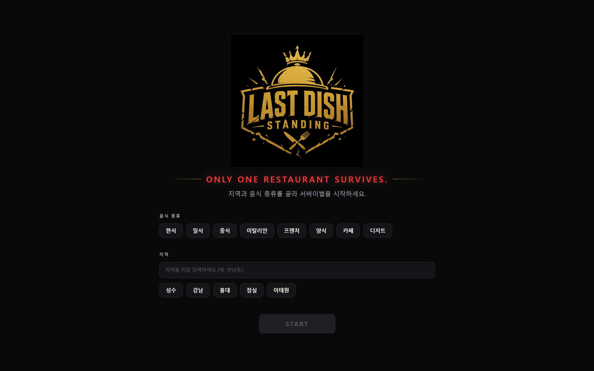
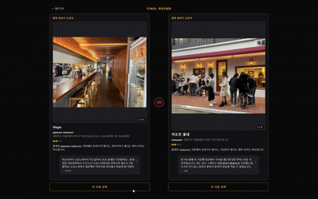
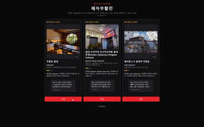
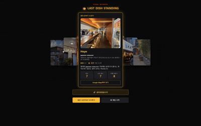

<div align="center">

# LAST DISH STANDING

**내 취향으로 뽑는 오늘의 맛집 서바이벌**

지역과 음식 종류를 고르면 실제 식당들이 1:1 토너먼트로 맞붙습니다.
평점에 휘둘리지 않고 사진·리뷰·가격·게임용 별명만 보고 직접 선택하세요.
마지막까지 살아남은 한 곳이 오늘의 우승 식당입니다.



</div>

---

## 목차

- [소개](#소개)
- [주요 기능](#주요-기능)
- [게임 규칙](#게임-규칙)
- [기술 스택](#기술-스택)
- [시작하기](#시작하기)
- [스크립트](#스크립트)
- [환경 변수](#환경-변수)
- [프로젝트 구조](#프로젝트-구조)
- [테스트](#테스트)
- [접근성 및 안내](#접근성-및-안내)

---

## 소개

일반 맛집 검색과 달리 **대결 중에는 평점을 숨깁니다.** 평점이 선택을 편향시키지
않도록, 사진·가격대·대표 리뷰·게임용 별명·한 줄 소개만 근거로 사용자가 직접
판단합니다. 실제 평점과 리뷰 수는 **최종 우승자가 확정된 뒤에만** 공개됩니다.

선택된 식당은 살아남아 다음 도전자와 계속 경쟁하고, 마지막까지 생존한 식당이
최종 Winner가 됩니다. 규모가 큰 게임에서는 **패자부활전**이 한 번 열립니다.

## 주요 기능

- 지역 + 음식 종류로 **Google Places API (New)** 실검색 기반 후보 구성
- 품질 조건(핵심 정보 2개 이상)을 통과한 식당만 참가
- 1:1 대결 → 선택 즉시 다음 대결로 진행 (선택 카드 하이라이트 연출)
- 참가 식당 수에 따른 **동적 라운드** 계산 (하드코딩 없음)
- 조건 충족 시 **패자부활전** 1회 (탈락 후보 중 부활 또는 건너뛰기)
- 최종 우승 화면: 평점·리뷰 수 공개, Google Maps 링크, 결과 공유(링크 복사 폴백)
- 우승 화면 후면 **3D 캐러셀**로 탈락 식당들을 다시 확인
- 게임용 별명·한 줄 소개 규칙 기반 생성, 정보 부족 시 fallback 표시
- 선택/부활/최종 우승 효과음, 무대 조명 컨셉 UI, 모바일·PC 반응형

### 화면 미리보기

**FINAL ROUND — 마지막 대결**



**패자부활전 — 탈락 후보 중 부활 또는 건너뛰기**



**FINAL WINNER — 우승 화면과 후면 탈락 식당 3D 캐러셀**



## 게임 규칙

| 항목 | 규칙 |
| --- | --- |
| 후보 품질 게이트 | 사진·리뷰·가격대 중 **2개 이상** 확보한 식당만 참가 |
| 참가 인원(Roster) | 최소 2개, 최대 8개 (품질 통과 후보가 8개 초과면 무작위로 8개 선정) |
| 시작 불가 조건 | 참가 가능 식당이 2개 미만이면 게임을 시작할 수 없음 |
| 일반 대결 수 | `참가 식당 수 - 1` (참가 2~8 → 대결 1~7) |
| 승자 결정 | 사용자의 선택으로만 결정 (평점은 승패에 영향 없음) |
| 연승 | 챔피언이 유지되면 +1, 도전자가 이기면 1로 리셋 |
| 패자부활전 | 참가 6개 이상 + 누적 탈락 3개 이상일 때 게임당 **최대 1회** |
| 부활 후보 | 탈락 식당 중 최대 3개(현재 챔피언 제외) |
| 평점 공개 | 대결·부활 중에는 비공개, **최종 우승자 확정 시에만** 공개 |

> 매 게임 후보를 무작위로 섞어 선정하므로, 같은 지역·음식이라도 라운드 구성이
> 매번 달라집니다.

## 기술 스택

- **React 18** + **TypeScript**
- **Vite 5** (개발 서버 / 번들러)
- **CSS Modules** (컴포넌트 스코프 스타일)
- **Vitest** + **@testing-library/react** (단위·상호작용 테스트)
- **fast-check** (게임 로직 property-based 테스트)
- **Google Maps Platform — Places API (New)** (Text Search / Place Details)
- **Web Audio API** (효과음 실시간 합성, 외부 오디오 파일 없음)

상태 관리는 별도 라이브러리 없이 `useReducer` 기반의 순수 상태 머신
(`src/game/reducer.ts`)으로 구성했으며, 게임 데이터는 클라이언트 메모리에만
보관합니다(백엔드·DB 없음).

## 시작하기

### 사전 준비

- Node.js 18 이상 권장
- Google Cloud 프로젝트에서 **Places API (New)** 활성화 및 API 키 발급

### 설치 및 실행

```bash
# 1) 의존성 설치
npm install

# 2) 환경 변수 파일 생성 후 API 키 입력
cp .env.example .env
# .env 를 열어 VITE_GOOGLE_MAPS_API_KEY 값을 실제 키로 채웁니다.

# 3) 개발 서버 실행
npm run dev
```

개발 서버는 기본적으로 `http://localhost:5173` 에서 실행됩니다.

## 스크립트

| 명령어 | 설명 |
| --- | --- |
| `npm run dev` | 개발 서버 실행 (HMR) |
| `npm run build` | 타입 체크 후 프로덕션 빌드 (`dist/`) |
| `npm run preview` | 빌드 결과물 로컬 미리보기 |
| `npm test` | 전체 테스트 1회 실행 |
| `npm run test:watch` | 테스트 watch 모드 |

## 환경 변수

| 변수 | 필수 | 설명 |
| --- | --- | --- |
| `VITE_GOOGLE_MAPS_API_KEY` | 예 | Google Places API (New) 키 |

- `.env` 파일은 **커밋되지 않습니다**(`.gitignore`에 포함). 실제 키를 넣어 로컬에서만 사용하세요.
- 저장소에는 `.env.example`만 포함되며, 키 형식만 안내합니다.
- 키에 API 제한을 걸었다면 **Places API (New)** 가 허용 목록에 있어야 하고,
  HTTP referrer 제한을 사용한다면 `localhost` 를 허용해야 개발 중 호출됩니다.

## 프로젝트 구조

```text
last_dish_standing/
├─ index.html
├─ vite.config.ts
├─ .env.example            # 환경 변수 예시 (실제 키는 .env)
├─ src/
│  ├─ main.tsx             # 진입점
│  ├─ App.tsx              # 상태(status)에 따른 화면 스위칭 + 로딩 파이프라인
│  ├─ components/          # 재사용 UI (RestaurantCard, Spotlight, RoundIndicator 등)
│  ├─ screens/             # 화면 (Start, Battle, RevivalRound, RevivalReveal, ChampionReveal, Winner ...)
│  ├─ game/                # 게임 로직 (rules, reducer, actions, useGame) + property test
│  ├─ services/            # Google Places 연동 (placesService) + 정규화기 (normalizer)
│  ├─ lib/                 # 유틸 (generator, shuffle, sound)
│  ├─ types/               # 공용 타입 정의
│  ├─ styles/              # 전역 스타일 · 컬러 토큰
│  └─ test/                # 테스트 셋업 · 픽스처
└─ .kiro/specs/            # 요구사항 · 설계 · 태스크 스펙 문서
```

### 상태 흐름

```text
setup → loading → playing ──(선택)──▶ playing (다음 대결)
                     │
                     ├──(부활 조건 충족)──▶ revival ──▶ playing
                     │
                     └──(마지막 대결)──▶ finished
loading ─(후보 부족·오류)─▶ error
```

## 테스트

```bash
npm test
```

- 게임 로직 순수 함수는 **property-based test**(fast-check)로 불변식을 검증합니다
  (예: 모든 참가 식당은 최소 1회 등장, 최종 Winner는 정확히 1개, 부활은 게임당 최대 1회 등).
- 컴포넌트·상호작용은 React Testing Library로 검증합니다
  (예: 대결 중 평점 미표시, 중복 선택 방지, 로딩 중 시작 버튼 비활성화 등).

## 접근성 및 안내

- 애니메이션은 `prefers-reduced-motion` 을 존중하여 모션 최소화 시 정적으로 표시합니다.
- 별명(SURVIVAL_TITLE)과 한 줄 소개는 **게임용 표현**이며 식당의 공식 정보가 아닙니다.
- 방송 프로그램의 로고·그래픽·고유 UI를 복제하지 않는 일반 서바이벌 컨셉으로 구성했습니다.

---

<div align="center">
<sub> 당신의 하루를 충만하게할 오늘의 식당은 어디인가요? 🍽</sub>
</div>
